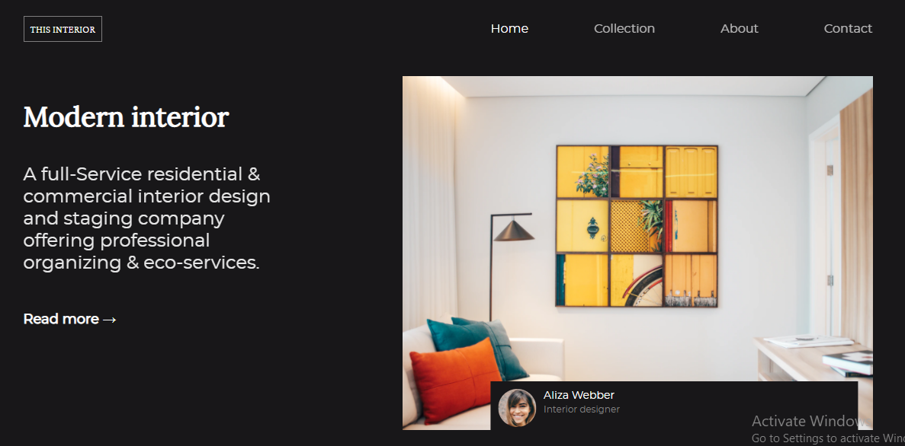

# Responsive Challenge 

<h1 align="center">Interior Consultant</h1>

<div align="center">
  <h3>
    <a href="https://lightme-fan-interior-consultant.netlify.app/">
      Demo
    </a>
    <span> | </span>
    <a href="https://github.com/lightme-fan/interior-consultant">
      Solution
    </a>
  </h3>
</div>

<!-- TABLE OF CONTENTS -->

## Table of Contents

-   [Overview](#overview)
    -   [Built With](#built-with)
-   [Features](#features)
-   [How to use](#how-to-use)
-   [Contact](#contact)
-   [Acknowledgements](#acknowledgements)

<!-- OVERVIEW -->

## Overview



-   You can see my demo by clicking this [link](https://lightme-fan-interior-consultant.netlify.app/)

-   In this project, I use sass compelling.


### Built With

<!-- This section should list any major frameworks that you built your project using. Here are a few examples.-->

-   This project is built with [sass](https://sass-lang.com/documentation/syntax)

## Features

- I have an index.html file.
- I also have scss folder which contains a variable folder and six sass files. Inside of the variables folder, there are three files, which are variables, font-face and mixin.

- I as well have css folder which contains manifest.css. Everything inside of this file is from sass.

<!-- List the features of your application or follow the template. Don't share the figma file here :) -->

## How To Use

<!-- Example: -->

To clone and run this application, you'll need [Git](https://git-scm.com) and [Node.js](https://nodejs.org/en/download/) (which comes with [npm](http://npmjs.com)) installed on your computer. From your command line:

```bash
# Clone this repository
$ git clone https://github.com/lightme-fan/interior-consultant

# Install dependencies
$ npm install

# Run the app
$ npm start
```

## Acknowledgements

<!-- This section should list any articles or add-ons/plugins that helps you to complete the project. This is optional but it will help you in the future. For example: -->

## Contact

-   Website: [Responsive challenge: interior consultant](https://lightme-fan-interior-consultant.netlify.app/})
-   GitHub: [lightme-fan](https://github.com/lightme-fan)
-   Twitter [Fanilo](https://twitter.com/Fanilo85066531)
